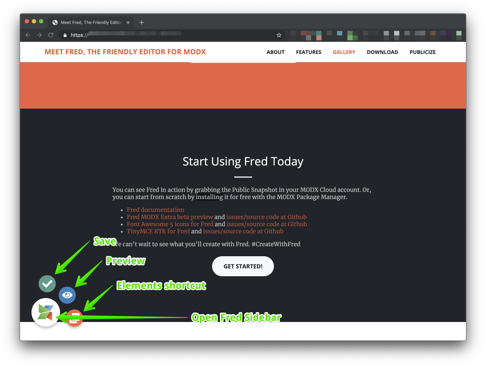
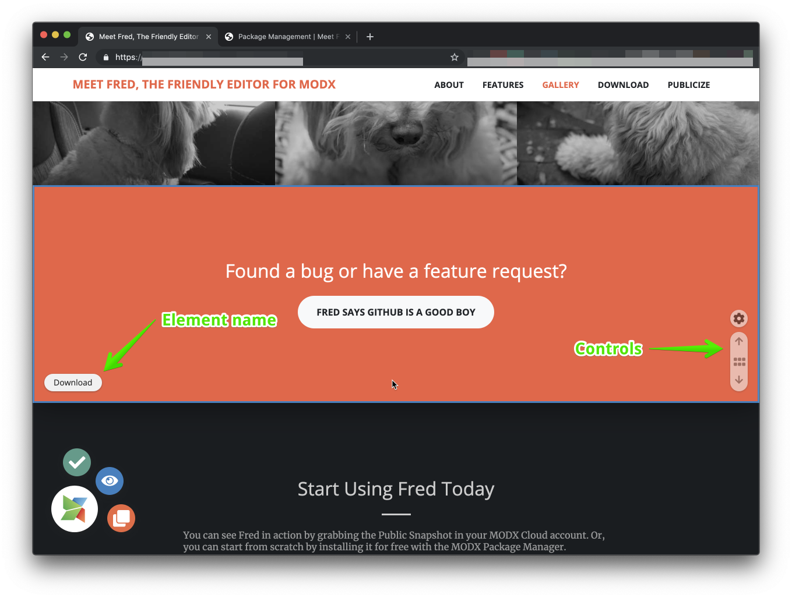
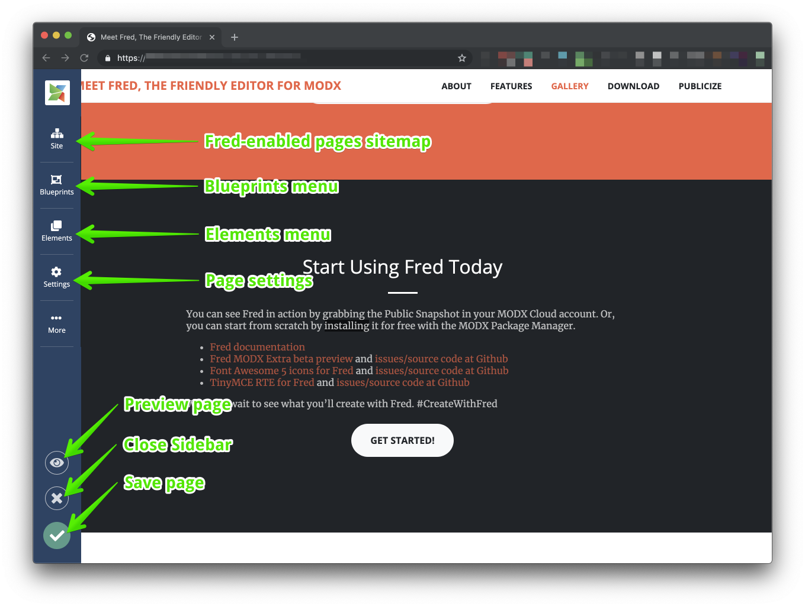
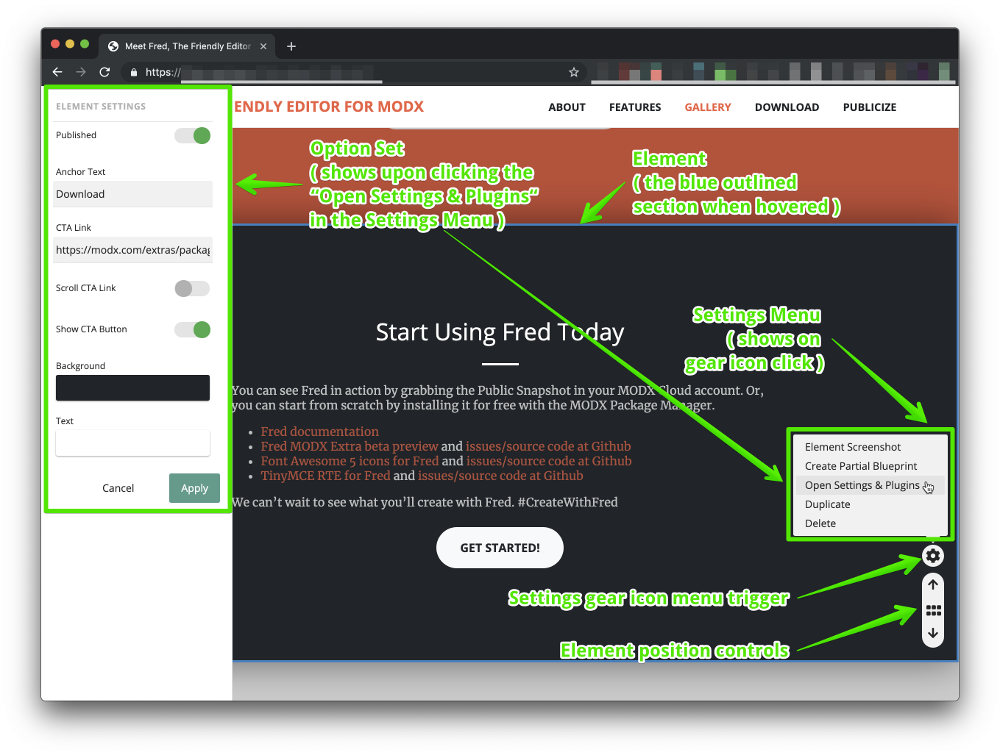

# Fred for Current MODX Developers

Fred is a visual drag-and-drop content editor that can minimize or eliminate the need for daily content authors and editors to use the MODX Manager. As such, Fred allows users to author content without having to learn the Manager, interacting with content as it will show on the page. This visual, drag-and-drop experience is considered more intuitive and easy to learn by many. 

Websites powered by Fred can co-exist with traditional MODX Manager controlled pages, but Fred-powered pages must be edited from the Fred UI.

When logged into a site as a Fred editor, you will see several circular icons overlaid on the page that give you access to the Fred controls:

When hovering parts of a Fred-enabled page, you will see sections highlighted with a blue border. These are the Elements used to create the page. The name of the Element used for that section will show in on the bottom left when hovered, and positioning and settings controls will be at the bottom-right:

Users will frequently interact with the Sidebar, accessed by clicking the main MODX icon. Depending on how the site owners or developers have Fred configured, these main Fred controls will be located in one of the corners on the page.

The “Site” menus is like the Manager tree, but only shows Fred-enabled pages.

The “Blueprints” menu gives you the ability to create and use [Blueprints](blueprints.md).

The “Elements” menu gives you access to use [Elements](elements.md) to construct or add to a page.

The “Settings” menu is where page settings are configured, similar to what is in the MODX Manager for scheduled publishing, menu options, advanced settings, URL alias, and pagetitle/longtitle/etc.

The “More…” menu gives users access to opening the page in the Manager, a link to the documentation, an optin to disable Fred, and a the ability to logout and view the site exactly as a normal site visitor would.

The “Preview” icon (eye) shows the page under a top bar with a responsive site preview simulator with phone, tablet and full desktop responsive views.

The “Close” icon (x) closes the sidebar, returning it to the initial Fred-loaded 4-circles state.

The “Save” icon (check mark) saves the page.

## Elements

[Elements](themer/elements/index.md) are the basic building block of Fred. These can be as simple as a headline, or much more complex like a complete product layout used in an e-commerce store. 

When logged into a site as a Fred editor, hovering parts of the page will highlight sections with a blue box, the boundary of the Element itself. Elements are configured by [Option Sets](themer/options/index.md) which are accessed by clicking the gear icon then the “Open Settings & Plugins” in the lower-right of the Element when hovered.

Elements can be duplicated or used more than one time on Fred pages. 

### Element Controls

When hovering an Element, a set of positioning controls at the bottom, with a gear icon for the Element's settings appears in the lower-right. 

The [Option Set menu](themer/options/index.md) is generated from a JSON text array managed through the [Fred Third-party Component](themer/cmp/elements/).

#### Settings Menu Trigger

The Option Sets attached to an Element are revealed by clicking the gear icon, just above the position conrols. 

#### Settings Menu

The Settings Menu allows users (with appropriate permissions to perform several actions on an Element):

- Take a screenshot of the current state of the Element used when [creating themes](themer/index.md)
- Create a [partial Blueprint](blueprints.md) based on the current state of the Element
- Open the Settings panel for configuring the Element
- Duplicating the Element immediately after the current one
- Delete the Element from the page

#### Position Controls

Elements can either be dragged into position by using the grip icon in the middle of the poisition controls, or click the up or down arrows to move them up or down on the page.

## Fred vs Traditional MODX Templates

What sets Fred apart from traditional MODX templates is the lack of reliance on Template Variables (TVs) for creating complex page layouts.

This brings the benefit of greater simplicity and possibly faster performance without sacrificing the flexibility that TVs brought to MODX in the first place.

In Fred, TVs are often replaced by [Option Sets](themer/options/index.md), and can be an effective substitue in many cases without the added complexity and database overhead of TVs. The current limitation for Option Sets is that they can only contain text values, so they only best used for things like text, textarea, richtext, numbers, etc.

## Where TVs make sense in Fred

TVs still have a place in Fred for pages that require the use of MIGX or Google Map marker TVs.

TVs also are also useful for segregating content into searchable vs non-searchable in your site. For example, things in a `[[*sidebar]]` TV could be omitted from search results with the parts of the page in the `[[*content]]` field still searched.

### What replaces TVs

In Fred, [Option Sets](themer/options/index.md) can effectively replace many use cases that previously would have required TVs in the MODX Manager.

Option settings are the controls that appear when you click the gear icon for each MODX Element on a page. The gear icon also gives content authors and editors access ot the typical MODX page settings like scheduled publishing, show/hid from menu, etc.

Option Sets can contain multiple items that previously would have required dedicated TVs such as toggles for enabling different layout options, text or richtext inputs, sliders to set numbers, color pickers, Font Awesome icon choosers, image uploaders, and more.  